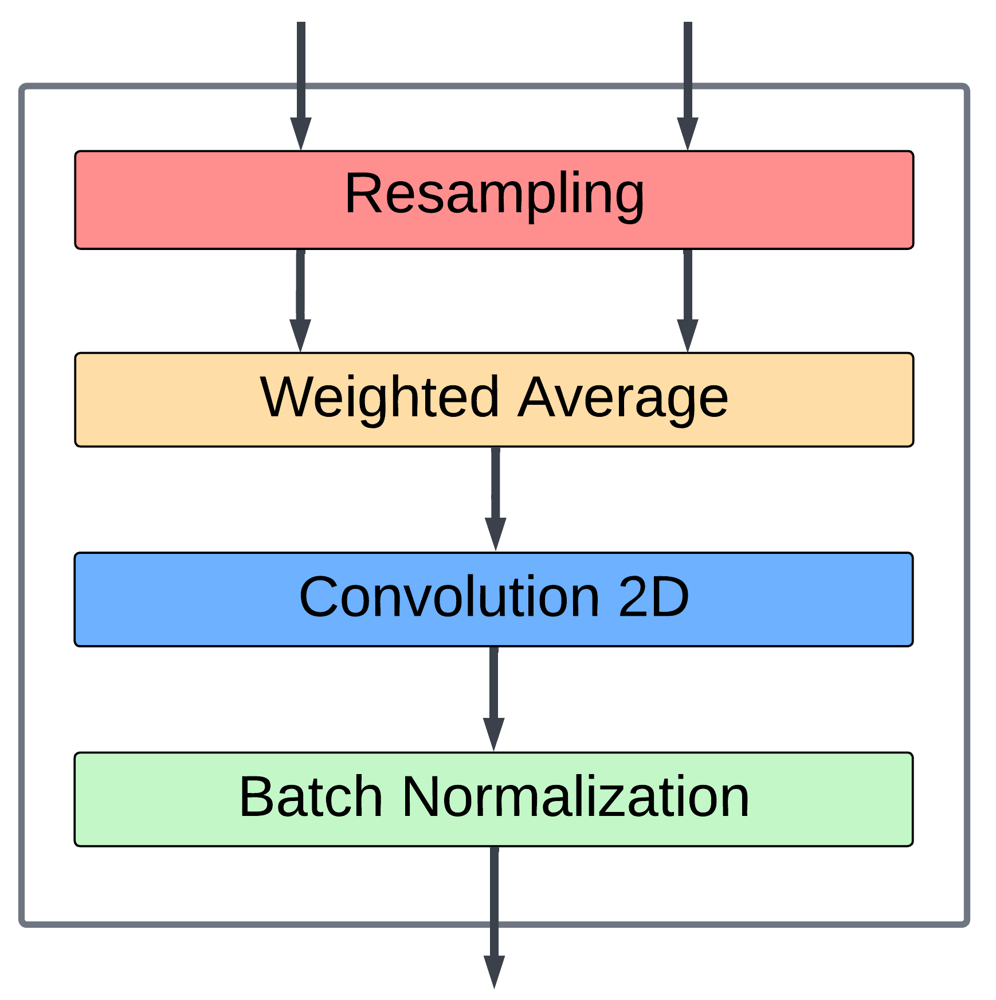
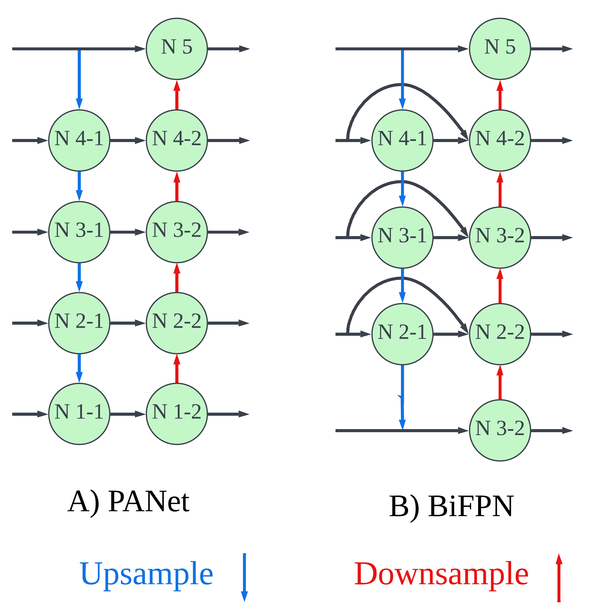
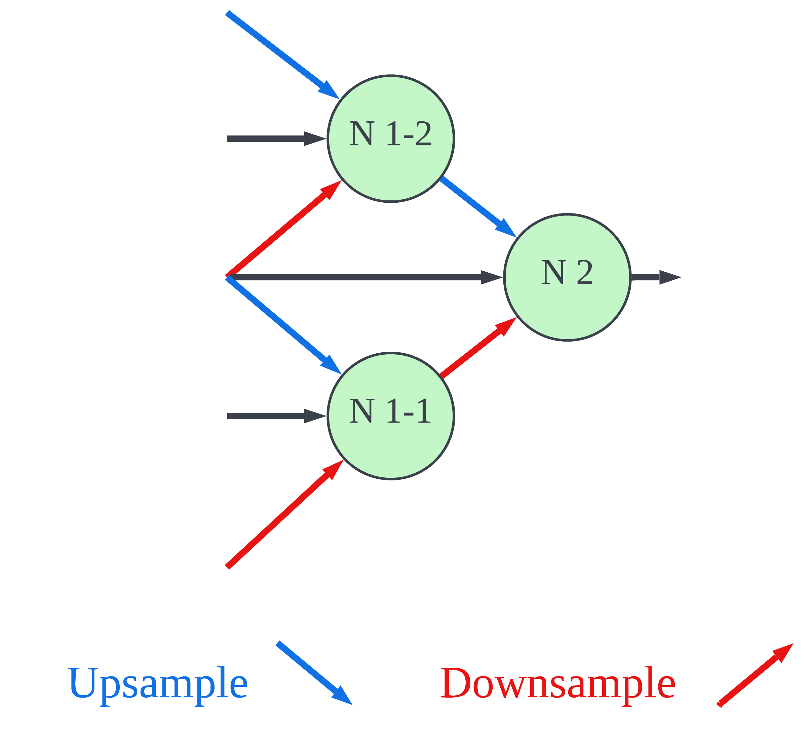
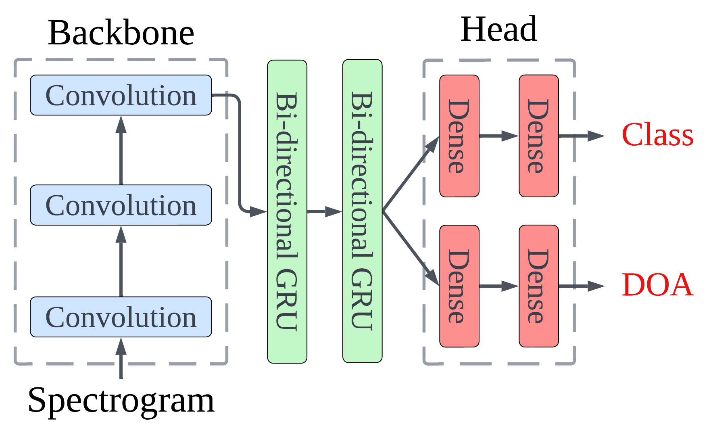
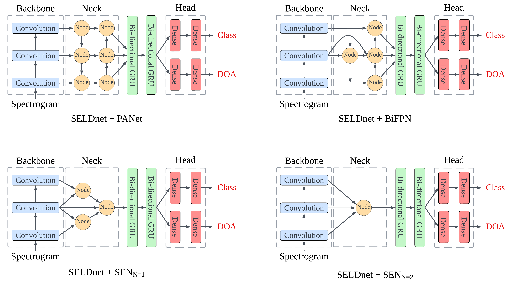

# Feature Aggregation in Deep Learning
Feature aggregation is a deep learning architectural techinque used to improve feature scaling and counteract the semantic gap. It is pivotal for the robustness of object detection networks for various sensor types, as features can vary in size/resolution due to distance (in CV or lidar) or amplitude (sound waves). Examples of computer vision neural networks incorporating feature aggregation include YOLO and SSD.

## Weighted Averaging Layer
The first script to examine is Weighted_Average_Layer. This script is a custom TensorFlow layer, which intakes 2+ feature maps (convolutional outputs) and returns a weighted average of the inputs. The weights are trainable variables, allowing for the network to directly compare and contrast different inputs and adjust their weights as the model trains.

## Node Submodel
Feature aggregators are made up of Node submodels, which consists of 4 steps:

1) Resampling:

Resampling is performed to make the feature maps inputs compatable shapes for further processing.

2) Weighted Averaging:

Weighted averaging fuses the feature maps with trainable weights. This allows the network to compare and contrast feature maps extracted from different scales.

3) Convolution:

The weighted average output tensor is then further refined with another convolution.

4) Batch Normalization:

The features extracted from the previous steps are then normalized to improve robustness.



## Full Feature Aggregation Submodels
The final aggregation sub-architectures consist of multiple nodes, aggregating extracted features from many scales and finally outputting one or more node outputs to the head (or prediction stage) of the neural network.

Example FA submodels:

<br /><br />

<br />
**C) Scale Encoder Network (SEN)**

## SELDnet with Feature Aggregation
SELDnet is an esteemed Sound Detection Neural Network (joint sound classification and localization). Here is an example of how the previous FA submodels can be integrated into such a model's architecutre. Link to the documentation for SELDnet: https://github.com/sharathadavanne/seld-net <br /> <br />
**SELDnet:**<br />
 <br /><br />
**SELDnet with Aggregation:**<br /><br />
 <br />

## Running the Training Code
**See documentation for SELDnet**: https://github.com/sharathadavanne/seld-net <br />
**Note**: The scripts from the repository above have been updated in this repository to be compatable with TensorFlow 2. However, they are executed the same way as described in their parent repository (above); which contains detailed information about training and datasets.

## Utilizing the Aggregation Library
To use this aggregation library, one can either create or use pre-designed feature aggregation archtectures from Feature_Aggregators.py. These aggregators are embedded in TensorFlow models as layers. The following sections demonstrate how to do this.

### Feature Aggregation script
This script contains premade aggregators, such as PANet, FPN, BiFPN, and SEN. Use these examples as templates to create custom aggregation designs.

When creating an aggregator, one must understand the different types of aggregation node classes.
Nodes for upsampling, downsampling, both up/downsampling, or dimension averaging are separate so the neural network does not have to reassess which opperation must be completed each pass through the network.

**Example Aggregator**

```python
class BiFPN(Model):
    def __init__(self, f, k, last=True):
        """
        Constructor for the BiFPN class.

        Args:
            f (int): Number of filters for convolution.
            k (int): Size of the convolution kernel.
            last (bool): Whether this is the last BiFPN in the network.

        Initializes the BiFPN with the specified parameters and creates the necessary nodes.
        """
        super(BiFPN, self).__init()
        self.last = last
        self.f = f
        self.k = k

        self.P2_1 = Node_Upsample(f, k)
        self.P1 = Node_Upsample(f, k)
        self.P2_2 = Node_Downsample_Upsample(f, k)
        self.P3 = Node_Downsample(f, k)

    def call(self, conv_outputs):
        """
        Call method for the BiFPN class.

        Args:
            conv_outputs (list of tf.Tensor): List of convolution outputs from different layers.

        Performs data flow as illustrated below:

        # C3 ------------> P3 --->
        # ^   ____|______   ^
        # |  /    v      \  |
        # C2 --> P2_1 --> P2_2 -->
        # ^       |        ^
        # |       v        |
        # C1 -----------> P1 ---->

        Returns the final feature map or a list of feature maps if 'last' is set to False.
        """
        P2_1 = self.P2_1([conv_outputs[-2], conv_outputs[-1]])
        P1 = self.P1([conv_outputs[-3], P2_1])
        P2_2 = self.P2_2([P2_1, P1, conv_outputs[-2]])
        P3 = self.P3([conv_outputs[-1], P2_2])

        if self.last:
            return P3
        else:
            return [P1, P2_2, P3]

    def get_config(self):
        return {"f": self.f, "k": self.k, "last": self.last}
```

**Note**: initialize nodes and layers in the __init__ method; if they are initialized in the call method, the weights will not properly update.

### Model script
To incorporate the model into an aggregator, simply insert it into the model like a layer.

Here is an example of how PANet is inserted into SELDnet in the keras_model.py script (the layer specs are simplified here for legibility):

```python
input_layer = Input(shape=(...))

# FM = Feature Map
FM = input_layer

conv_outputs = []

for i, conv_block in enumerate(pool_size):
        FM = Conv2D(...)(FM)
        FM = BatchNormalization()(FM)
        FM = Activation(...)(FM)
        FM = MaxPooling2D(...)(FM)
        FM = Dropout(...)(FM)
        
        # Save output from each conv for aggregation
        conv_outputs.append(FM)

aggregator = PANet(filters, kernel_size)(conv_outputs)

next_layer = Permute((2, 1, 3))(aggregator)
etc...
```
