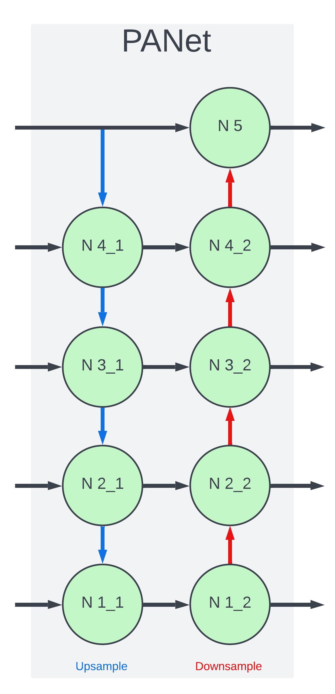
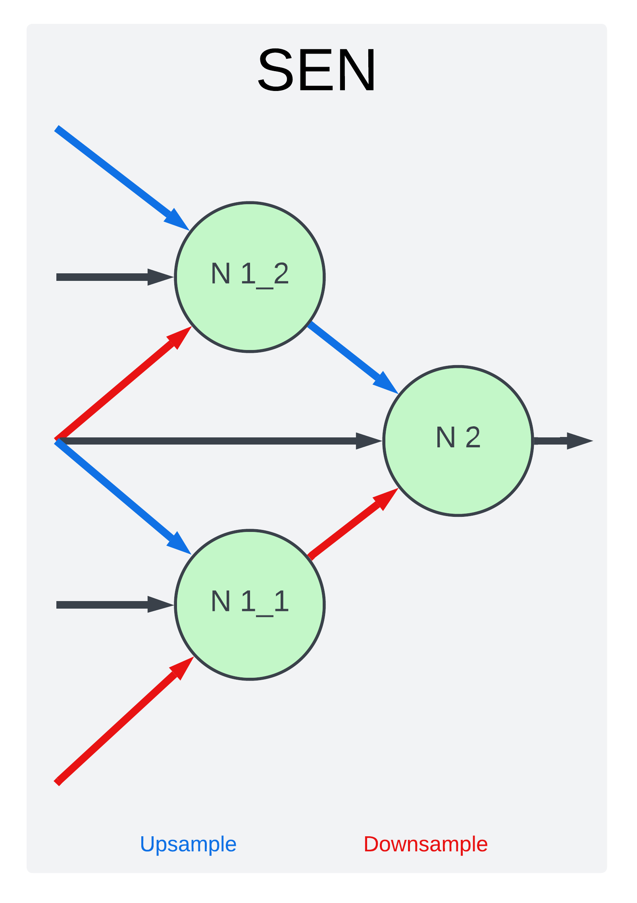
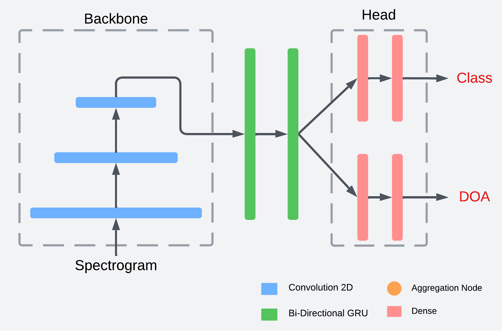

# Feature Aggregation in Deep Learning
Feature aggregation is a deep learning architectural techinque used to improve scaling of features. It is pivotal for the robustness of object detection networks for various sensor types, as features can vary in size due to distance (in CV or lidar) or amplitude (sound waves). This architectural design also allows for dynamic prediction of variable number of objects in a sample when combined with anchors. Computer vision examples of this include YOLO and SSD, which are trained with samples of one object per sample but can simultaneous detect multiple objects of different classes.

## Weighted Averaging Layer
Starting from the bottom up, the first script to examine is Weighted_Average_Layer. This script is a custom TensorFlow layer, which intakes 2 or more convolutional outputs and outputs a weighted average of the two. The weights are trainable variables, allowing for the network to directly compare and contrast different inputs and weigh their relevance with respect to each other.

## Node Submodel
Feature aggregators are made up of Node submodels, which consists of 4 steps:

1) Resampling:

Resampling is done to make the node inputs (outputs from previous convolutions in the network) compatable shapes for further processing.

2) Weighted Averaging:

Weighted averaging allows the network to compare and contrast features extracted from different scales, ensuring that the model doesn't identify objects or features with one specific size that may vary in real-world applications.

3) Convolution:

The weighted average output tensor is then further processed with another convolution.

4) Batch Normalization:

The features extracted from the previous steps are then normalized to improve robustness.

## Full Feature Aggregation Submodels
The final aggregation sub-architectures consist of multiple nodes, aggregating extracted features from many scales and finally outputting one or more node outputs to the head (or prediction stage) of the neural network.

Example FA submodels:

## SELDnet with Feature Aggregation
SELDnet is an esteemed Sound Detection Neural Network (joint sound classification and localization). Here is an example of how the previous FA submodels can be integrated into such a model's architecutre.    
SELDnet:
  
SELDnet + PANet:
  
SELDnet + BiFPN:
  
SELDnet + SEN:

